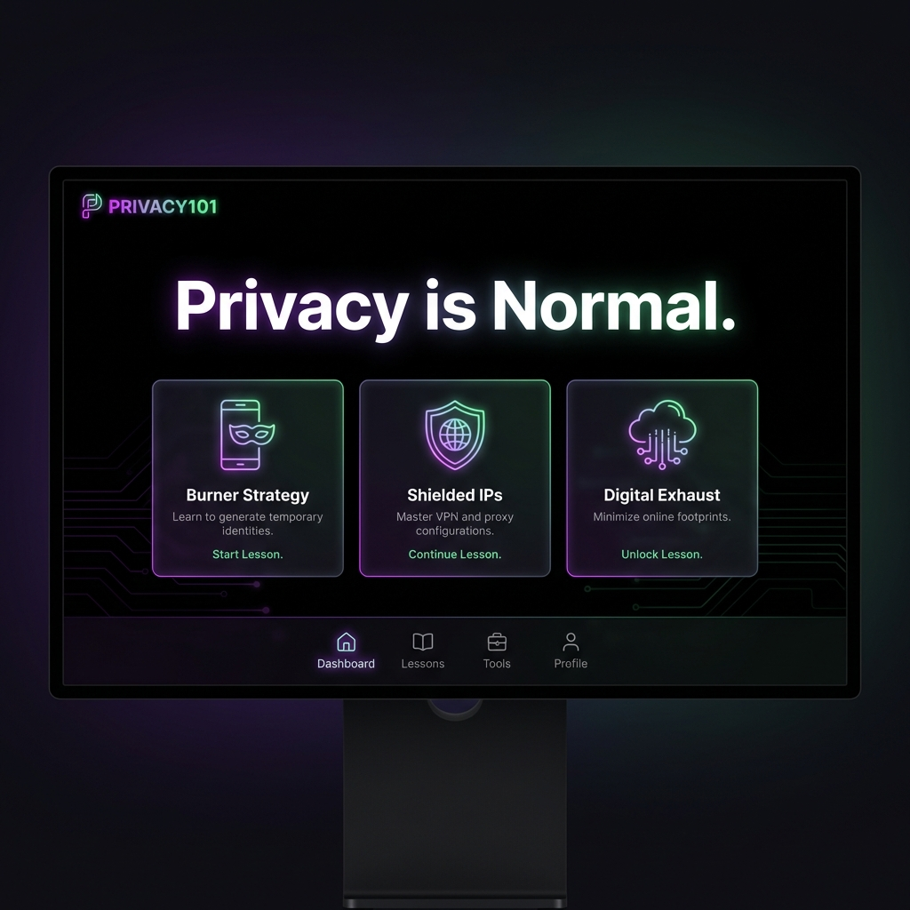
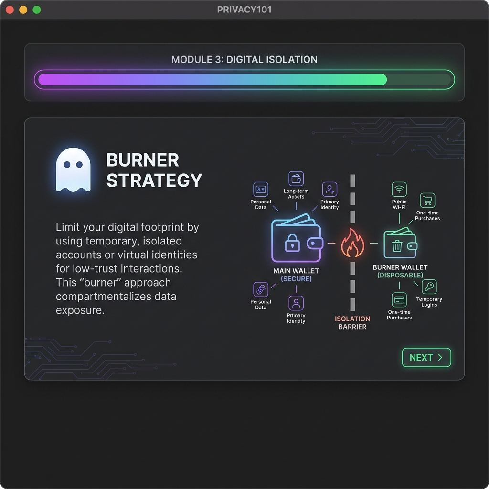

# 🔐 PRIVACY101

**Learn Privacy. Earn $PRIV. Own Your Data.**

PRIVACY101 is a decentralized educational platform built on **Solana**. It teaches the fundamental principles of cypherpunk operations and blockchain privacy through an interactive, slide-based curriculum.




## 🚀 Features

- **On-Chain Progress**: Your learning journey is permanently recorded on the Solana Devnet using Program Derived Addresses (PDAs).
- **Interactive Slides**: Concise, data-rich slides covering Burner Strategies, IP Shielding, RPC Privacy, and Dark Pools.
- **Knowledge Verification**: Each lesson ends with a quiz to ensure you've mastered the concepts before claiming rewards.
- **$PRIV Rewards**: Complete lessons to receive $PRIV badge tokens directly to your wallet.
- **Transcent Aesthetics**: A premium, dark-mode cypherpunk UI designed to inspire digital sovereignty.

## 🛠 Tech Stack

- **Frontend**: Next.js 15, React, Tailwind CSS, Framer Motion
- **Blockchain**: Solana (Devnet), Anchor Framework
- **Notifications**: React Hot Toast with direct Solana Explorer links
- **Wallet**: Solana Wallet Adapter integration

## 📂 Project Structure

- `src/app`: Next.js App Router and Page components.
- `src/components`: Reusable UI components including the `SlideDeck`.
- `src/hooks`: Custom hooks for Solana program interaction (`usePrivacyProgram`).
- `src/lib`: Core logic and curriculum data.
- `privacy_program`: Anchor source code for the on-chain progress tracking.

## 🏁 Getting Started

### Prerequisites

- Node.js & npm
- Solana CLI
- Anchor CLI

### Installation

1. Clone the repository:
   ```bash
   git clone <repository-url>
   cd anoncoin-privacy101
   ```

2. Install dependencies:
   ```bash
   npm install
   ```

3. Set up environment variables:
   Create a `.env.local` file with:
   ```env
   NEXT_PUBLIC_RPC_URL=https://api.devnet.solana.com
   ```

4. Run the development server:
   ```bash
   npm run dev
   ```

## 📜 Curriculum

1. **Burner Strategy**: Digital isolation using temporary wallets.
2. **Shielded IPs**: Preventing physical location leaks.
3. **RPC Privacy**: Taking control of your data gateway.
4. **Dark Pools**: Confidential trading and MEV protection.

---

Built for the **Solana Privacy Hackathon** • Powered by **Anoncoin**
